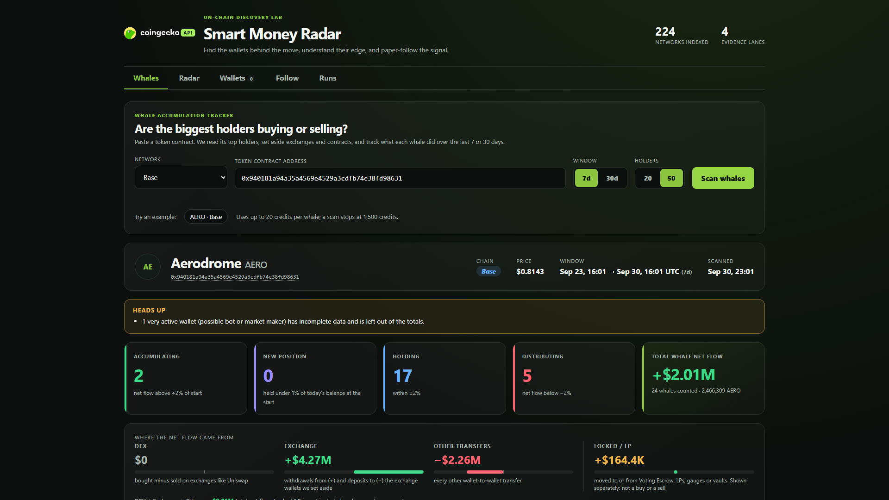
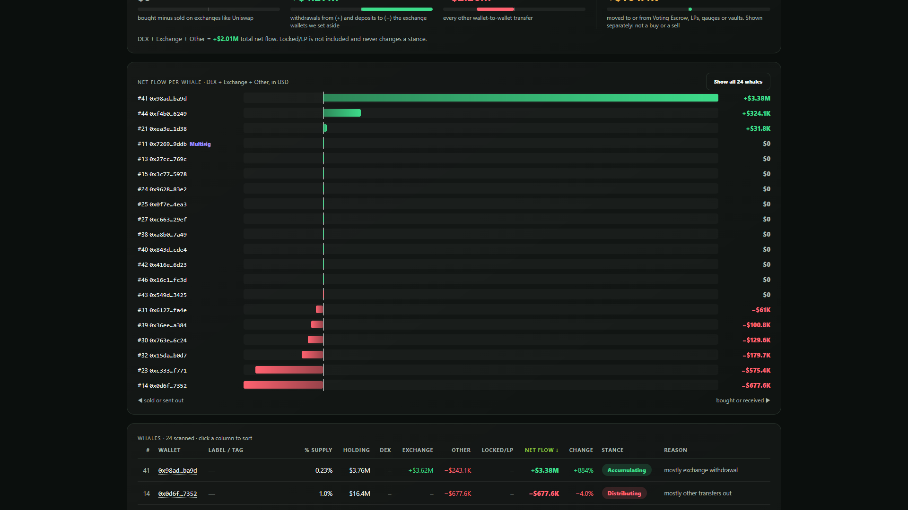
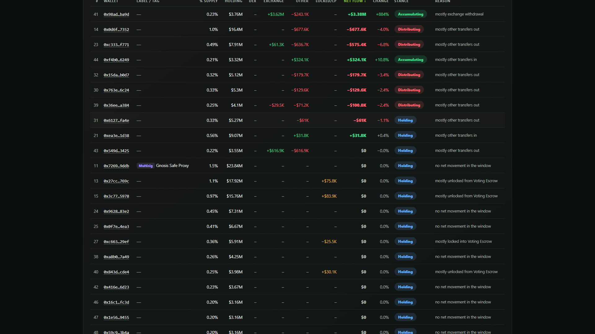

<picture>
  <source media="(prefers-color-scheme: dark)" srcset="core/brand/coingecko-api-on-dark.svg">
  
</picture>

# Whale Accumulation Tracker

[](https://codespaces.new/Tanaka686/whale-accumulation-tracker)

**Try it with nothing to install:**

1. Click **Open in GitHub Codespaces** above (you need a free GitHub account), then **Create codespace**.
2. Wait 1-2 minutes. It installs everything and starts the app by itself; your browser opens the app on port 8000. (If it doesn't, open the **Ports** tab and click the globe next to 8000.)
3. In the **Whales** tab, paste your own CoinGecko API key, pick **Pro** or **Demo**, and scan a token. The holder and wallet endpoints need the **Analyst** plan or higher ([get a key](https://www.coingecko.com/en/api?utm_source=github&utm_content=tanaka_l2)).

Your pasted key stays in the app's memory for that browser session only: it is never saved to disk, logged or sent back. Prefer to skip the paste box? Add `COINGECKO_API_KEY` (and `COINGECKO_ENVIRONMENT`) as a [Codespaces secret](https://docs.github.com/en/codespaces/managing-your-codespaces/managing-your-account-specific-secrets-for-github-codespaces).

Just want to look first? The read-only [`demo/`](demo) folder is a static snapshot (no server, no key) that deploys to Vercel; see [Static demo](#static-demo).

Paste a token contract and see whether its biggest holders are **buying, selling or just holding** over the last 7 or 30 days.

The tracker reads a token's top holders, sets aside exchanges, contracts and pools, then follows what each remaining whale did with the token: DEX trades, exchange withdrawals, other transfers, and tokens moved in and out of locks and LPs. Every whale gets a stance (Accumulating, New position, Holding, Distributing) and a plain-English reason, and each scan is saved as a JSON file.



It runs on the [CoinGecko API](https://www.coingecko.com/en/api?utm_source=github&utm_content=tanaka_l2) onchain endpoints (top holders, wallet trades, wallet transfers) and started from CoinGecko's open-source Smart Money Radar starter, whose Radar, Wallets, Follow and Runs tabs are still included.

## What you get

- **Whales tab** (the default tab): network + token contract + 7d/30d + 20/50 holders, and a clear loading state while it scans.
- **Summary cards:** how many whales are Accumulating, New position, Holding, Distributing, and the total whale net flow in USD.
- **4-part flow breakdown:** DEX, Exchange, Other transfers, and Locked/LP shown separately.
- **Diverging bar chart** of net flow per whale (green = in, red = out).
- **Sortable whale table** with wallet links to the block explorer, labels and tags (for example `Multisig`), % of supply, holding value, each flow part, net flow, change vs the starting balance, stance and reason.
- **Collapsible lists** of the wallets that were set aside (with their label and the reason) and of wallets with incomplete data.
- **Warnings** when 24h volume is more than 50x liquidity, when wallets are incomplete, or when the credit cap is reached.
- **A JSON file per scan** in `data/whales/`.





## How it works

```
token contract + network (eth | base | bsc) + window (7d | 30d) + holders (20 | 50)
        |
        v
1. TOP HOLDERS        GET /onchain/networks/{network}/tokens/{address}/top_holders
        |             + the token call for price, its pools, 24h volume and liquidity
        v
2. SORT THE HOLDERS   set aside: burn addresses, the token itself, its liquidity pools,
        |                        labels that look like contracts or exchanges
        |             keep as whales: everything else (multisigs get a "Multisig" tag,
        |                        other labels are shown as they are)
        v
3. PER WHALE          GET .../wallets/{address}/trades     ?token=...&from=...&to=...
        |             GET .../wallets/{address}/transfers  ?token=...&from=...&to=...
        v
4. DE-DUPLICATE       a swap shows up as a trade AND as a transfer with the same tx hash;
        |             the trade is kept, so a swap is never counted twice
        v
5. SPLIT THE FLOW     DEX | Exchange | Other transfers | Locked/LP
        |
        v
6. STANCE + REASON    judged on DEX + Exchange + Other only
        |
        v
7. RESULT             Whales tab + data/whales/<time>-<network>-<token>.json
```

### The 4-part flow breakdown

| Part | What it counts | Counts toward net flow? |
|---|---|---|
| **DEX** | Trades: bought minus sold | Yes |
| **Exchange** | Transfers to or from the exchange wallets that were set aside. A withdrawal from an exchange is positive, a deposit to one is negative | Yes |
| **Other transfers** | Every other wallet-to-wallet transfer, in minus out | Yes |
| **Locked / LP** | Transfers to or from the contracts and pools that were set aside (Voting Escrow, LPs, gauges, vaults). Locking or adding to an LP is negative, unlocking or removing is positive | **No.** Shown on its own; it is not a buy or a sell |

**Net flow = DEX + Exchange + Other.** Amounts are computed in tokens first; USD uses the trade's own volume for trades and today's token price for plain transfers (the transfers endpoint has no USD field).

### Stance rules

The API has no historical balances, so the balance at the start of the window is estimated:

```
start balance = current balance - net flow - Locked/LP
```

| Stance | Rule |
|---|---|
| **New position** | start balance is below 1% of today's balance |
| **Accumulating** | net flow is more than +2% of the start balance |
| **Distributing** | net flow is less than -2% of the start balance |
| **Holding** | anything in between |
| **Incomplete data** | the wallet filled every page it was allowed to fetch (10 pages of 300 rows per call). Shown as "very active wallet (possible bot or market maker)", with no stance, and left out of the totals |
| **Not scanned** | the scan's credit cap was reached before this wallet was started; left out of the totals |

Two details that matter:

- Locking tokens in Voting Escrow or adding them to an LP is **not** distributing, and unlocking is **not** accumulating. The stance only looks at DEX + Exchange + Other.
- A wallet whose start balance is about zero only because its tokens came back from a pool or a lock (more than half of its inflow is Locked/LP) is called **Holding** ("mostly removed from a liquidity pool"), not New position.

Each whale also gets a short reason such as `mostly DEX buying`, `mostly exchange withdrawal`, `mostly locked into Voting Escrow` or `mostly other transfers out`. It names the biggest of the four parts. All thresholds and keyword lists live in one clearly marked section of `app/config.py` (`WHALE ACCUMULATION TRACKER`).

### Credits

Each API request or page costs 1 credit. A scan uses 2 credits for the holders and token calls, plus at most 20 per whale (up to 10 pages of 300 rows for trades and 10 for transfers). A whole scan stops starting new wallets at **1,500 credits**. Requests that time out (408) or fail on the server (5xx) are retried up to 3 times.

Measured on Base with 50 holders and a 7-day window: AERO used about 56-61 credits, and the busier NVDAc used about 193. Wallets that were set aside cost nothing.

## Requirements

- A CoinGecko API key on the **Analyst plan or higher**. The top holders and wallet endpoints are not on the free Demo plan, and the app shows a locked card instead of hanging when the plan is too low. Get a key: [coingecko.com/en/api](https://www.coingecko.com/en/api?utm_source=github&utm_content=tanaka_l2).
- Networks: Ethereum (`eth`), Base (`base`) and BNB Chain (`bsc`).
- Python 3.12 and [`uv`](https://docs.astral.sh/uv/). `uv` downloads Python 3.12 for you.

## Setup

### Windows (PowerShell)

```powershell
# 1. Install uv (no admin rights needed), then close and reopen PowerShell
irm https://astral.sh/uv/install.ps1 | iex

# 2. Get the code and install everything
git clone https://github.com/Tanaka686/whale-accumulation-tracker
cd whale-accumulation-tracker
uv python install 3.12
uv sync --extra dev

# 3. Add your API key (paste it after COINGECKO_API_KEY=, then save)
copy env.example .env
notepad .env

# 4. Start the app
uv run uvicorn app.server:app --port 8000
```

Open <http://127.0.0.1:8000>. Press **Ctrl+C** in the PowerShell window to stop it.

### Mac / Linux

```bash
# 1. Install uv, then open a new terminal
curl -LsSf https://astral.sh/uv/install.sh | sh

# 2. Get the code and install everything
git clone https://github.com/Tanaka686/whale-accumulation-tracker
cd whale-accumulation-tracker
uv python install 3.12
uv sync --extra dev

# 3. Add your API key
cp env.example .env
$EDITOR .env

# 4. Start the app (or: make run)
uv run uvicorn app.server:app --port 8000
```

Open <http://127.0.0.1:8000> and press **Ctrl+C** to stop.

### Your API key

`.env` holds `COINGECKO_API_KEY=` and `COINGECKO_ENVIRONMENT=pro` (use `demo` only for a Demo key, which cannot run whale scans). `.env` is in `.gitignore`: never commit it. The key is read on the server only; it is not sent to the browser and it is not printed or logged.

No `.env` key? The Whales tab shows a box where a visitor pastes their own key instead (Pro or Demo). It is checked once with CoinGecko, kept only in the server's memory against a random session cookie (idle sessions expire after 2 hours), and never written to disk, logged or returned by any API. If `.env` has a key, that key is used and the box is hidden.

### Static demo

`demo/` is a read-only copy of the Whales dashboard that loads one saved scan (`demo/scan.json`, VIRTUAL 30d). No server, no API key, no build step. `vercel.json` makes Vercel serve only that folder. To refresh it with a newer scan: `uv run python scripts/build_demo.py [path/to/scan.json]`, then commit `demo/`. The script strips the saved file path and refuses to write a scan that contains anything that looks like a key or a local path.

### Run the tests

```
uv run pytest -q
```

The tests run offline, use no credits and need no key.

## Limitations

Read these before you rely on a result:

- **Only current top holders are listed.** A whale that sold everything during the window is no longer a holder, so it is missing. The tool is better at spotting accumulation than at spotting exits.
- **Busy wallets may be incomplete.** A wallet with more trades or transfers than the page limit (about 3,000 rows per call) is marked "Incomplete data" and left out of the totals, so on very active tokens the totals are understated. These are often bots or market makers.
- **The starting balance is estimated** as today's balance minus the flow (the API has no historical balances). Holder data is a snapshot that can lag by about a minute, and the window ends at the last full minute, so the estimate can be slightly off.
- **Labels, stances, reasons and the flow breakdown are computed by this tool.** They are not CoinGecko fields or official CoinGecko classifications. Whether a wallet counts as an "exchange" or a "contract" comes from keywords matched against CoinGecko's address label, which are editable examples and can be wrong.
- **Exchange and Locked/LP only recognise wallets that are in the holder list.** An exchange deposit address, or a gauge, that is not among the top holders shows up under "Other transfers".
- **A transfer is not a trade.** Tokens received from an unlabelled wallet may be a purchase from a private seller, a payment, or one entity moving funds between its own wallets. The tool cannot tell.
- **USD for plain transfers uses today's price**, not the price at the time of the transfer.
- **Top holders data is in Beta** at CoinGecko and may change or have gaps.
- **Volume vs liquidity is only a hint.** The warning at more than 50x flags tokens where bots or wash trading are likely, but it is a rule of thumb.
- Not financial advice.

## Data and outputs

CoinGecko API supplies the underlying token, pool, holder, trade, transfer and price data. Wallet labels, stances, reasons, shortlists, flow breakdowns and reports are computed by this repository and are editable examples, not CoinGecko API fields, financial advice or validated trading signals. Inspect the supporting data and adapt the rules before relying on them.

## The rest of the app

The original Smart Money Radar tabs still work next to Whales:

- **Radar:** trending or new tokens, and the wallets that recur across their top traders.
- **Wallets:** profiles for those wallets (PnL, win rate, holdings, trades, transfers).
- **Follow:** paper copy-trading of chosen wallets (paper only, no real orders).
- **Runs:** reports and article kits for paper runs and backtests.

Commands such as `make backtest`, `make forward` and `make autopilot` are described in `AGENTS.md`, which also has the repo map for AI coding agents.

## Project layout for the Whales tab

```
app/accumulation.py     the whole method: filters, flow split, stances, scan(), JSON saving
app/config.py           editable keyword lists, thresholds and caps (WHALE ACCUMULATION TRACKER section)
app/server.py           POST /api/whales/scan, GET /api/whales/config
core/client.py          CoinGecko client: top_holders, wallet_trades, wallet_transfers, retries
web/whales.js|css       the Whales tab
tests/                  test_accumulation*.py, test_whales_api.py, test_client_*.py
data/whales/            one JSON file per scan (git-ignored)
```

Demo software. Analysis only: no trades are made, and CoinGecko API provides market data; it doesn't execute trades or give financial advice.

<!-- coingecko-links:start -->
- CoinGecko API: https://www.coingecko.com/en/api?utm_source=github&utm_content=tanaka_l2
- Pricing: https://www.coingecko.com/en/api/pricing?utm_source=github&utm_content=tanaka_l2
- Docs: https://docs.coingecko.com?utm_source=github&utm_content=tanaka_l2
- Agent Skill + MCP: https://docs.coingecko.com/ai-integration?utm_source=github&utm_content=tanaka_l2
<!-- coingecko-links:end -->
